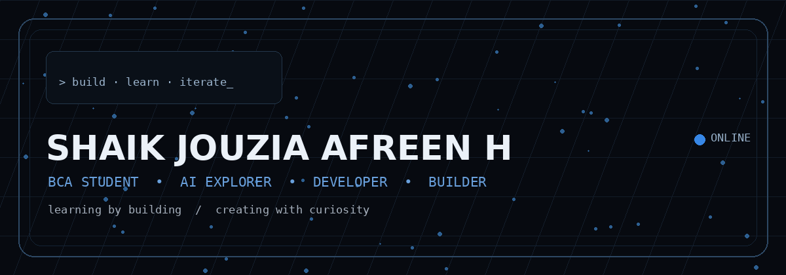

<!-- SHAIK JOUZIA AFREEN H -->

<p align="center">
  
</p>

<h1 align="center">Hi, I'm Shaik Jouzia Afreen H </h1>

<p align="center"><strong>BCA Student · AI Explorer · Developer · Builder</strong></p>

<p align="center">I learn by building — exploring AI, software development, and creative technology.</p>

<p align="center">
  <a href="https://github.com/jouzia">GitHub</a> ·
  <a href="https://www.linkedin.com/in/jouzia-afreen-h-369018344/">LinkedIn</a> ·
  <a href="https://jouziaportfolio.vercel.app/">Portfolio</a>
</p>

---

##  About Me

I'm **Shaik Jouzia Afreen H**, a BCA student at **St. Joseph's College of Arts & Science (Autonomous)**, building my foundation across AI, web development, and software engineering.

I enjoy turning ideas into working projects — especially when a project lets me combine **AI + interfaces + practical problem solving**.

> I'm early in my journey — and that's exactly why I'm building in public, experimenting often, and improving with every project.

---

##  What I'm Exploring

| Area | Focus |
|---|---|
|  AI | AI applications, agents, LLM-powered experiences |
|  Development | React, JavaScript, Python, Streamlit |
|  Frontend | Responsive UI, animation, glassmorphism |
|  Learning | Machine Learning, advanced React, API design |
|  Backend | Supabase, PostgreSQL, authentication & storage |
|  Engineering | Modular architecture, deployment, experimentation |

---

##  Featured Projects

###  [Bud-AI](https://github.com/jouzia/Bud-AI)
Multi-agent educational AI platform exploring agent routing, stateful study environments, memory, reward-driven evaluation, React/Next.js and Python.

###  [Chat-AI](https://github.com/jouzia/Chat-AI)
Python-based AI project exploring conversational systems, assistant logic, dashboards and supporting components.

###  [Portfolio](https://github.com/jouzia/Portfolio)
Full-stack portfolio built with React + Vite, Tailwind CSS, Framer Motion and Supabase, including authentication, certificate storage and project management.

###  [OpenEnv-Core](https://github.com/jouzia/OpenEnv-Core)
Interactive academic dashboard with a Logic Forge, AI companion, CGPA projection and animated glassmorphism UI.

###  [MCP](https://github.com/jouzia/MCP)
AI-powered web perception and multi-agent MCP project using Next.js, TypeScript, Notte SDK, Patchright and Python.

###  [buddy-lab-demo](https://github.com/jouzia/buddy-lab-demo)
Next.js application experiment focused on modern component-based web development.

---

##  Achievements

-  **1st Place — PPT Presentation**  
  Won first place in a PPT presentation competition. *No certificate was issued.*

-  **3rd Place — Start-up Business Plan Competition**  
  Intra-Departmental Start-up Business Plan Competition · St. Joseph's College · **02 Aug 2024**

-  **QuizOff 2026 — India's Biggest AI Quiz**  
  Recognised among selected participants in an AI quiz organised by CampusCrew and hosted on Unstop · **19 Jul 2026**

---

##  Certifications

**IBM SkillsBuild** — *Classifying Data Using IBM Granite*  

**HubSpot Academy** — *Social Media Certified*  
Valid **May 23, 2026 – Jun 21, 2028**

**CampusCrew × Unstop** — *QuizOff 2026: India's Biggest AI Quiz*  
Recognition / participation certificate · **19 Jul 2026**

---

##  Education

### Bachelor of Computer Applications — BCA
**St. Joseph's College of Arts & Science (Autonomous)**  
**2024 – 2027**

---

##  Tech Stack

**Languages:** `Python` `JavaScript` `TypeScript` `Java` `HTML` `CSS`

**Frontend:** `React` `Next.js` `Vite` `Tailwind CSS` `Framer Motion`

**AI / Data:** `LangChain` `Gemini` `Groq / Llama` `AI Agents` `ChromaDB` `Streamlit`

**Backend / Cloud:** `Supabase` `PostgreSQL` `Authentication` `Storage` `Vercel`

**Tools:** `Git` `GitHub` `GitHub Actions` `VS Code` `Linux`

---


## GitHub Activity

<p align="center">
  
</p>

<p align="center">
  
</p>

---

## Contributions

<p align="center">
  <picture>
    <source
      media="(prefers-color-scheme: dark)"
      srcset="https://raw.githubusercontent.com/jouzia/jouzia/output/github-snake-dark.svg"
    />
    <source
      media="(prefers-color-scheme: light)"
      srcset="https://raw.githubusercontent.com/jouzia/jouzia/output/github-snake.svg"
    />
    
  </picture>
</p>

---

##  My Approach

```text
Curiosity → Learn → Build → Break things → Debug → Improve → Repeat
```

I don't want my profile to pretend that I've already done everything.

I want it to show that I'm **actively learning, actually building, and getting better.**

---

##  Let's Connect

<p align="center">
  <a href="https://github.com/jouzia">GitHub</a> ·
  <a href="https://www.linkedin.com/in/jouzia-afreen-h-369018344/">LinkedIn</a> ·
  <a href="https://jouziaportfolio.vercel.app/">Portfolio</a>
</p>

<p align="center"><strong>Open to internships, collaborations, projects and opportunities to learn.</strong></p>

<p align="center"><sub>Built with curiosity • maintained with consistency • one project at a time.</sub></p>
